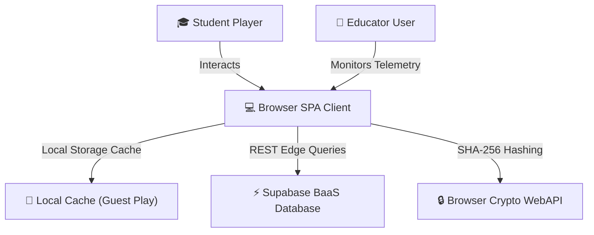
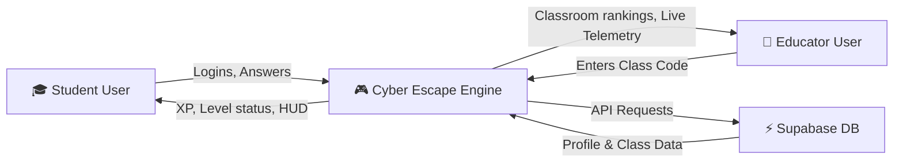

# Cyber Escape with Simba: System Documentation & Technical Report

---

### **Project Information**
*   **Project Title**: Cyber Escape with Simba — Gamified Cybersecurity Learning Platform & Telemetry Dashboard
*   **Live Deployed URL**: [https://siya2040.github.io/cyber-escape/](https://siya2040.github.io/cyber-escape/)

### **Project Team Details**
*   **Group Lead**: Siya Chauhan
*   **Group Member**: Vishesh Duggal

---

## 📋 Table of Contents
1. **Introduction (What is the project?)**
2. **Project Motivation (Why was it built?)**
3. **System Architecture (How does it work?)**
4. **Data Flow Diagrams (DFDs)**
5. **Database Design & ER Diagram (ERD)**
6. **Deployment & Technical Stack**
7. **Developer Manual (How to Use, Maintain, and Extend)**

---

## 1. Introduction (What is the project?)
**Cyber Escape with Simba** is a narrative-driven, gamified cybersecurity learning platform. Guided by a cyber-cat assistant named Simba, players solve interactive challenges to patch compromised mainframes. The platform features two core experiences:

### **Student / Player Portal**
*   **10 Security Rooms**: Interactive rooms covering phishing, passwords, cryptography, network security, SQL injection, OSINT, MFA push fatigue, metadata leaks, and breach incident response.
*   **Interactive dialogue engine**: Simba reacts to player selections with dynamic retro text dialogues and facial changes (happy, alerts, warning) while providing contextual hints.
*   **Persistent Leveling**: Tracks score, levels, XP rewards (+150 XP to +300 XP), and completion times.
*   **Security Badge Case**: Gallery containing 10 badges representing major CompTIA Security+ learning domains.

### **Educator / Teacher Portal**
*   **Classroom Telemetry Network**: Students link to an educator group code (like `1234`) to report speedruns and scores.
*   **Live Telemetry Dashboard**: Classroom dashboard displaying real-time classmate scores, levels, completed rooms, and times using live Supabase queries.
*   **Curriculum Mapping**: Post-level summaries link puzzle challenges back to professional NIST and OWASP standards.

---

## 2. Project Motivation (Why was it built?)
Traditional cybersecurity education faces significant friction:
*   **Dry Video Compliance**: Standard corporate and academic training relies on passive slide decks, leading to extremely low knowledge retention (<30% after 30 days).
*   **Steep Learning Curve**: Most gamified security platforms (like CTFs) require terminal experience, which acts as a barrier for non-technical beginners.
*   **No Teacher Insights**: Free browser games lack mechanisms for classroom instructors to easily track homework completions or student scores.

**Cyber Escape with Simba** bridges this gap by wrapping core security guidelines in a gamified, retro 8-bit aesthetic. It lowers the barrier of entry with interactive sandboxes (such as testing password strength against brute-force times in real-time) and offers teachers an automated telemetry leaderboard to monitor classrooms.

---

## 3. System Architecture (How does it work?)
The application uses a modular, client-serverless architecture designed for zero-compile speeds and rapid deployment:



1.  **SPA Frontend Client (HTML5/CSS3/JS)**: Renders the retro cyberpunk terminal interface. It handles game routing, rendering, local caching, and CRT overlays entirely in the browser.
2.  **Web Cryptography API**: Hashing engine used to secure passcodes locally using SHA-256 before writing to the cloud.
3.  **Supabase BaaS (Database & Auth)**: Handles data storage and user query APIs without requiring a separate Node/Express server container:
    *   **PostgreSQL**: Handles candidate profiles and classroom score tables.
    *   **REST API Gateway**: Exposes secure endpoints accessed via publishable keys.

---

## 4. Data Flow Diagrams (DFDs)

### **DFD Level 0: Context Diagram**
Shows the boundary of the Cyber Escape platform and data transfers with external entities.



---

## 5. Database Design & ER Diagram (ERD)

The database schema is mapped inside a single relational PostgreSQL table `profiles` to support high-performance, real-time leaderboard aggregation:

### **ERD Representation**
```mermaid
erDiagram
    PROFILES {
        uuid id PK
        string username UNIQUE
        string passcode "SHA-256 Encrypted Hash"
        integer xp
        integer level
        integer score
        integer maxxp
        string[] completedrooms "Array of completed room IDs"
        string[] badges "Array of unlocked achievement badges"
        jsonb roomtimes "Solve time timestamps per room"
        boolean classroomlinked
        string classroomcode
        timestamp created_at
    }
```

---

## 6. Deployment & Technical Stack

*   **Frontend**: Native HTML5, ES6 JavaScript, and custom CSS3 variables (Flexbox and CSS Grid layout, 60FPS CRT keyframes).
*   **Database Service**: Supabase PostgreSQL Cloud Serverless.
*   **Security Protection**: Web Cryptography API SHA-256 client-side hashing.
*   **Deployment Hosting**: Deployed to GitHub Pages' edge content delivery network (CDN).

---

## 7. Developer Manual (How to Use, Maintain, and Extend)

### **Local Setup**
1. Clone the project repository:
   ```bash
   git clone https://github.com/siya2040/cyber-escape.git
   ```
2. Double-click `index.html` to run the game natively in Chrome, Brave, Edge, or Safari.

### **Adding a New Room**
To extend the game with Room 11, add a new config block to `roomsConfig` in `assets/js/game_v2.js`:
```javascript
{ room: 11, title: "New Security Challenge", accent: "var(--cyber-cyan)", glow: "rgba(0, 255, 255, 0.15)", icon: "🛡️", requiredLevel: 5, xpReward: 200, scoreReward: 500 }
```
Then, implement the puzzle logic, input handlers, and correct answer validators inside `assets/js/puzzles_v2.js`.

### **Securing Brave Shields & Adblockers**
Because Supabase requests are sent dynamically to a third-party server, Brave browser's built-in tracker blocker (Brave Shields) may intercept the connection. 
* To resolve this, click the orange lion icon in the address bar and switch **Shields to OFF** for this domain, or play in **Guest Mode** which saves progress directly to browser `localStorage`.
